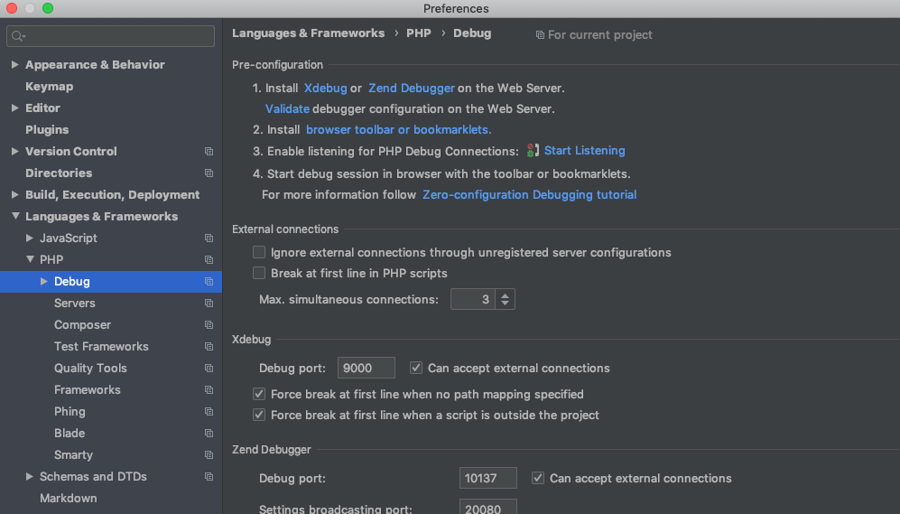
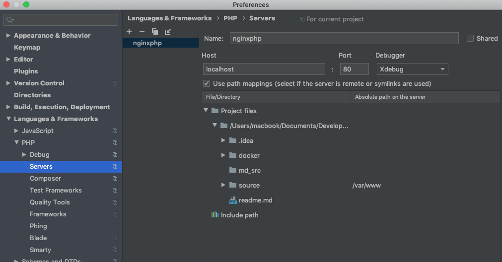
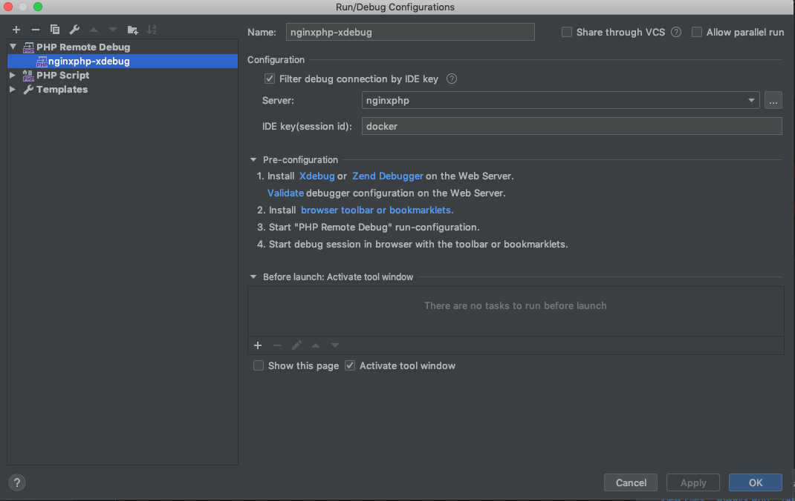
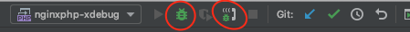

# Usage of nginxphp

* cd docker
* docker-compose up -d

> Put the sourcecode into the source directory, even if the container has been started ;)

# Installing extensions

## How to install mongodb

* Comment out the mongo part in Dockerfiles
* put /docker/composer folder to composer container and run the related sh script (see example in docker-compose file)

# How to Use devnginxphp with PhpStorm as remote debugger

## Docker part

* cd docker
* docker-compose -f docker-compose-dev.yml build
* docker-compose -f docker-compose-dev.yml up -d

## PhpStorm part

* PHPSTORM->Preferences

* Run->Edit Configuration

* Start debugging and visit website: localhost

